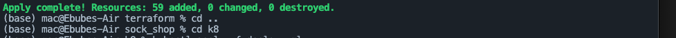
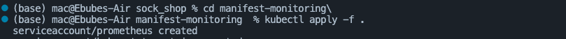
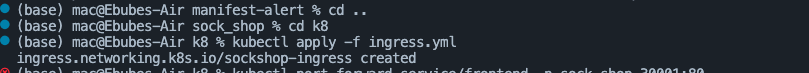
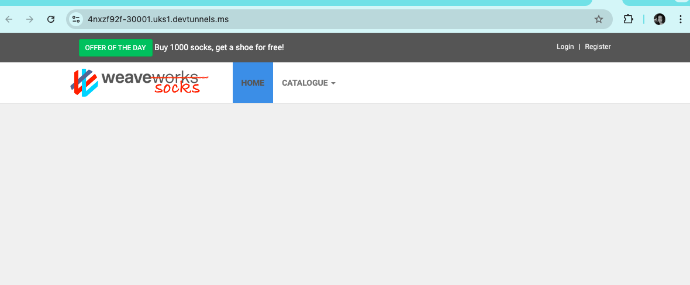
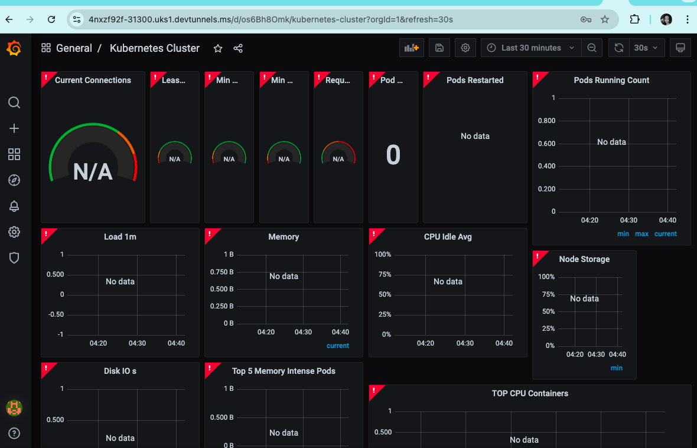
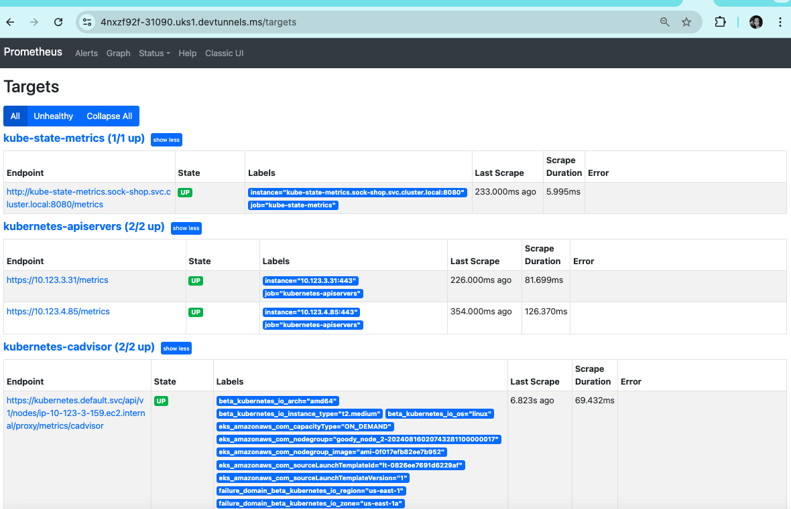

# Socks Shop Microservices Application Deployment

## Project Overview
The aim of this project is to deploy a Socks Shop microservice-based application using IaaC Infrastructure as Code (specifically, Terraform). It will involve provisioning resources on AWS while using Kubernetes for container orchestration.
The key tools and technologies include: 

1. Terraform: for provisioning and managing the infrastructure.
2. Kubernetes to manage the containers.
3. Helm for efficient package management of Kubernetes resources.
4. Prometheus for application monitoring.
5. Grafana for visualizing metrics and performance data.
6. Kubernetes cluster (e.g. EKS, AKS etc.)

## Prerequisites
Ensure the following are installed and/or created already.

### Tools and Packages
- [Kubectl](https://kubernetes.io/docs/tasks/tools/install-kubectl/): Command-line tool for Kubernetes clusters
- [Terraform](https://www.terraform.io/downloads): Infrastructure as Code tool
- [Ansible](https://docs.ansible.com/ansible/latest/installation_guide/intro_installation.html): Automation tool for configuration management
- A Kubernetes cluster (e.g., AWS EKS, Google GKE, Minikube, etc.)

This project involved the use of port forwarding instead of using a domain/certificate manager. In the latter approach, install Helm:
- [Helm](https://helm.sh/docs/intro/install/): Kubernetes package manager

### Getting Started
- **AWS Account**: Necessary for provisioning cloud infrastructure.
- **AWS CLI**: For managing AWS resources, [install AWS CLI](https://docs.aws.amazon.com/cli/latest/userguide/getting-started-install.html)

## Infrastructure Provisioning

Terraform is used to set up any necessary AWS resources, including EKS (Elastic Kubernetes Service) cluster which will be used in this project.

### Steps:

1. **Initialize Terraform**:  
   Run this command in your working directory to initialize Terraform:
   
   `terraform init`

2. **Terraform Plan**:

    This previews the changes made by Terraform in an infrastructure plan without applying them.

This shows the outcome of the `terraform plan` command.

3. **Apply Terraform Configuration**:

    Execute the following command to create the required resources:

`terraform apply --auto-approve`

*This step provisions all resources created in the terraform file including an EKS cluster, and other AWS resources.*

## Deploying the Application
1. Configure Kubectl:

    Kubectl is a command line tool to interact with a Kubernetes cluster. Ensure [Kubectl](https://kubernetes.io/docs/tasks/tools/install-kubectl/) is installed.

    Set up Kubectl to connect to your EKS cluster:

`aws eks update-kubeconfig --name sock-shop --region us-east-1`

2. Navigate to the k8 directory and deploy the application by applying the deployment file:

    `kubectl apply -f deployment-file.yaml`

    After applying the deployment file, the Socks Shop microservice app is deployed on the EKS cluster provisioned in the terraform file.

3. Check the Services:

    List all running services in the sock-shop namespace:

    The command `kubectl get pods,svc` shows the status of pods and services in the Kubernetes cluster:

To target the services on Socks Shop namesapce, run this command: 
    `kubectl get services -n sock-shop`

4. Apply Manifest files for both monitoring and alerts:

    i. Manifest Monitoring: 
    ii. Manifest Alert: 

## Setting up Ingress

An Ingress file/resource is used to manage external access to the services in a Kubernetes cluster.

Apply the Ingress Configuration:

The Ingress file, located in the k8 directory, enables HTTP/HTTPS access to services:

`kubectl apply -f ingress.yaml`

## Accessing the Microservice Application on the web using portforwarding

For accessibility reasons, port forwarding was used to direct traffic from a local port on my machine to a specific port on a pod within the Kubernetes cluster. This is particularly useful for accessing services running inside the cluster without exposing them to external networks. As a result, key services were selected for port forwarding to achieve the intended objective.

1. Portfowarding the frontend service:

`kubectl port-forward service/front-end -n sock-shop 30001:80`

The command above targets the frontend service of the local machine using http://localhost:30001. 

2. Portfowarding Grafana service:

You can now access the Grafana UI locally at http://localhost:31300

`kubectl port-forward service/grafana-svc 31300:80 -n sock-shop`

3. Portforwarding Prometheus services:

You can access Prometheus locally at http://localhost:31090 to view metrics. This is a secure and straightforward way to interact with Prometheus without creating public access.

`kubectl port-forward service/prometeus-svc 31090:90 -n sock-shop`

## Conclusion
This provides an overview and set up guide in setting up a Socks Shop application. This is done in a Kubernetes cluster on AWS, with integrated monitoring and secure access. With this setup, automation of infrastructure provisioning can be easily done, thereby simplifying application management, and monitoring application health effectively.